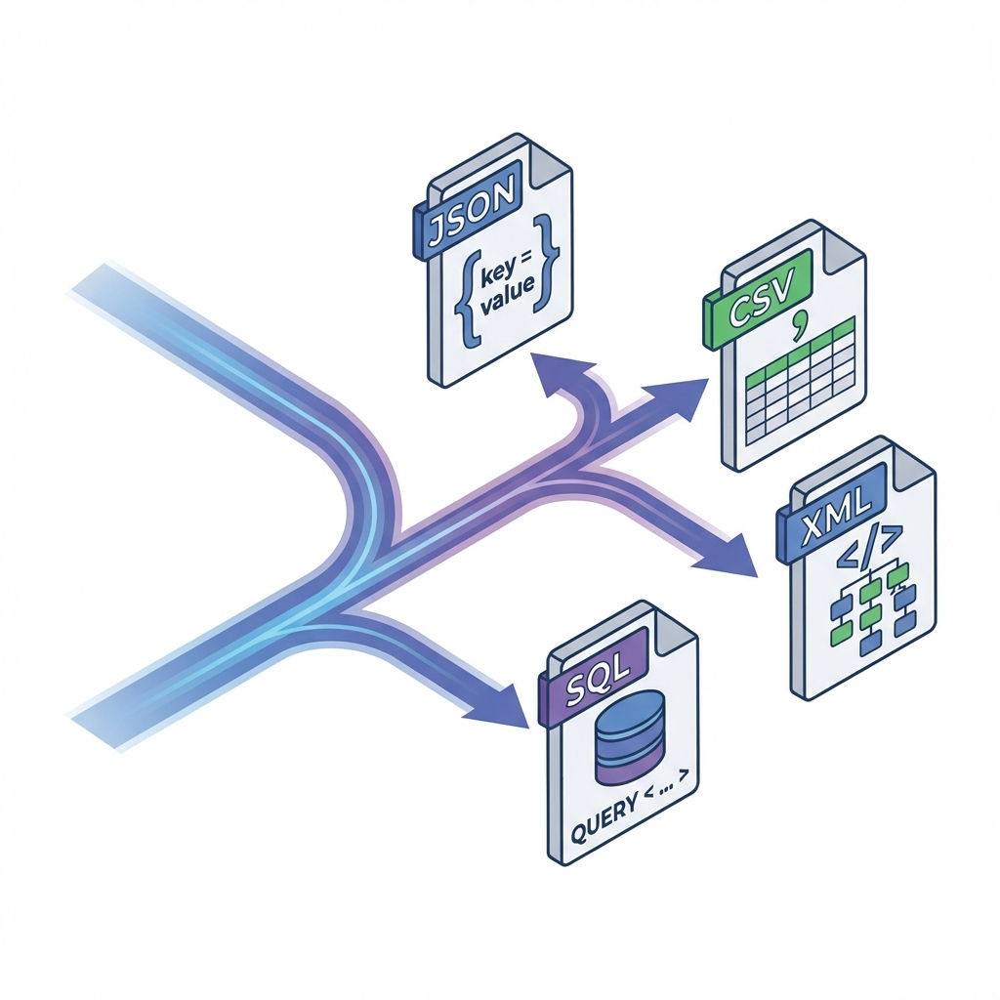

# ProjectShobdo


> **An openly released Bengali lexical corpus providing structured data for language preservation, linguistic research, and NLP development.**

ProjectShobdo is a comprehensive, open-source initiative to modernize the Bengali language for the digital age. It provides a clean, structured, and multi-format dataset of over 45,000 Bengali words, complete with meanings, pronunciations, parts of speech, and etymologies.

## 📦 Dataset Formats

We provide the dataset in multiple industry-standard formats to suit every use case, from web development to linguistic research.



| Format | File Path | Best For |
| :--- | :--- | :--- |
| **JSON** | [`dist/json/dictionary.min.json`](dist/json/dictionary.min.json) | Web Apps, REST APIs, NoSQL |
| **CSV** | [`dist/csv/dictionary.csv`](dist/csv/dictionary.csv) | Data Science (Pandas/R), Excel |
| **SQL** | [`dist/sql/dictionary.sql`](dist/sql/dictionary.sql) | Mobile Apps (Android/iOS), Offline DBs |
| **XML** | [`dist/xml/dictionary.xml`](dist/xml/dictionary.xml) | Linguistic Research (TEI-Lite compliant) |

## 🚀 Quick Start

### For Developers (Node.js)
You can use the raw JSON data directly in your project.

```javascript
const dictionary = require('./dist/json/dictionary.min.json');
console.log(dictionary.find(w => w.word === 'অভিধান'));
```

### For Researchers (Python)
Load the CSV data using Pandas for analysis.

```python
import pandas as pd
df = pd.read_csv('dist/csv/dictionary.csv')
print(df.head())
```

## 🛠️ Build from Source

If you want to regenerate the distribution files from the source `dictionary.json`:

1.  **Install Dependencies**:
    ```bash
    npm install
    ```

2.  **Run Build Script**:
    ```bash
    npm run build
    ```

This will process `dictionary.json` and update all files in the `dist/` directory.

## 🤝 Contributing

We welcome contributions! Whether it's fixing a typo, adding a missing word, or improving the etymology data.

1.  Fork the repository.
2.  Edit `dictionary.json` (this is the **Source of Truth**).
3.  Run `npm run build` to verify your changes.
4.  Submit a Pull Request.

## 📄 License

This dataset is licensed under the **[Creative Commons Attribution-ShareAlike 4.0 International (CC BY-SA 4.0)](https://creativecommons.org/licenses/by-sa/4.0/)**.

You are free to:
*   **Share**: Copy and redistribute the material in any medium or format.
*   **Adapt**: Remix, transform, and build upon the material for any purpose, even commercially.

Under the following terms:
*   **Attribution**: You must give appropriate credit to **ProjectShobdo**.
*   **ShareAlike**: If you remix, transform, or build upon the material, you must distribute your contributions under the same license as the original.
